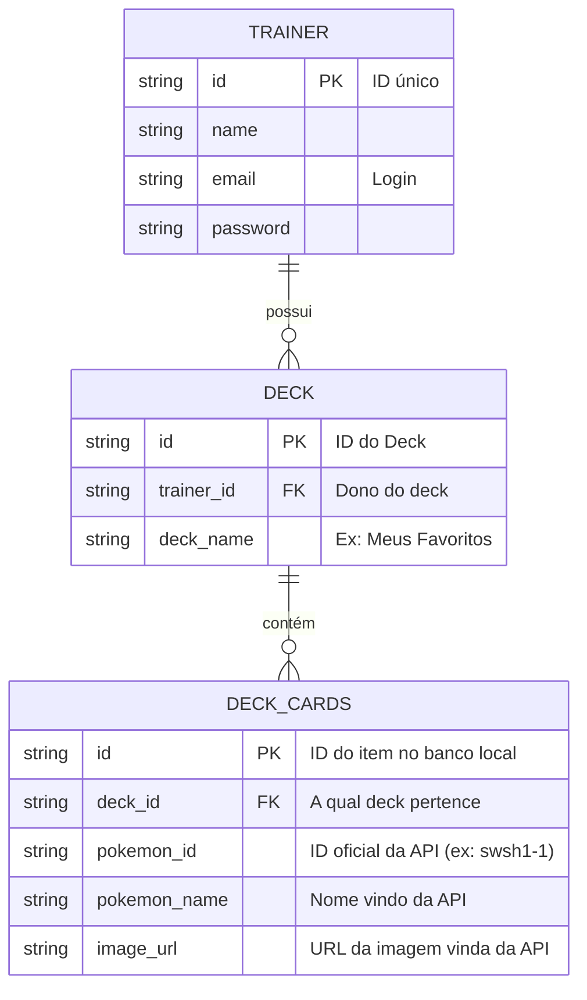

# 🛠️ Especificação Técnica (Tech Spec) - PokeDeck Studio

Este documento descreve o modelo de dados da aplicação necessários para o funcionamento do ecossistema PokeDeck Studio.

## 1. Modelo de Dados (Diagrama ER)

Abaixo está o Diagrama Entidade-Relacionamento (DER) que representa a estrutura do nosso "banco de dados" (`db.json`) e como as informações se conectam.

## 2. Dicionário de Dados

Breve explicação das tabelas que compõem o banco de dados dinâmico (`db.json`):

* **Trainers::** Armazena as informações de perfil e credenciais de acesso para autenticação.
    * **id:** Identificador único gerado automaticamente pelo JSON Server (String ou Hash).
    * **name:** Nome completo do treinador.
    * **email:** Chave de acesso única, utilizada para realizar o Login e identificar o usuário.
    * **password:** String para validação de acesso ao painel privado.
* **Decks:** Define as coleções ou agrupamentos de cartas criados pelo treinador.
    * **id:** Identificador único do deck gerado pelo JSON Server.
    * **trainer_id::** Chave estrangeira (FK) que vincula o deck ao seu dono. **Regra de Negócio:** Um deck só pode ser editado pelo treinador que o criou.
    * **deck_name:** Título personalizado dado pelo usuário (ex: "Estratégia Fogo", "Favoritos").
* **Deck_Cards:** Registra cada instância de carta salva dentro de um deck específico. Os dados aqui são oriundos da API Pública.
    * **id:** Identificador único do item no banco local.
    * **deck_id:** Chave estrangeira (FK) que vincula a carta ao deck correspondente.
    * **pokemon_id:** O ID oficial da carta vindo da Pokémon TCG API (ex: `swsh1-1`). Serve como referência para consultas detalhadas na API externa.
    * **pokemon_name:** Cópia do nome da carta (armazenado localmente como cache para exibição rápida na listagem).
    * **image_url:** URL da imagem da carta vinda da API pública, persistida localmente para otimizar o carregamento da galeria do usuário.
